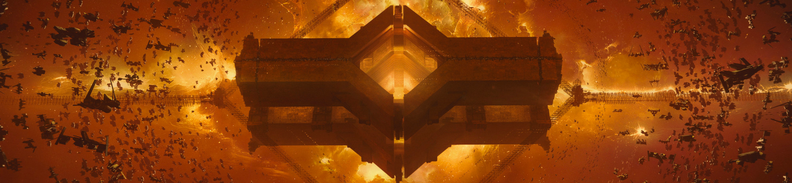

# Why Build on EVE Frontier?

<figure><figcaption></figcaption></figure>

In **EVE Frontier**, survival is only the starting point. What truly defines this next generation sandbox is the unprecedented agency it gives to Builders, creators, and developers. Frontier expands on decades of EVE design philosophy, player-driven economies, emergent gameplay, and systemic depth, and pushes it into a new era of openness, modularity, and community-driven evolution.

## A Sandbox Where Builders Shape the Universe

At the core of Frontier are **Smart Assemblies**, physical and programmable structures anchored in space. These are not just buildings, they are the foundation of a living infrastructure layer that players can design, modify, automate, and optimize. Turrets, markets, storage facilities, refineries, logistics hubs, and defensive networks become active components of your strategy. Your constructions do not just exist in the world, they act within it.

Frontier is designed as a true open environment. The world evolves not only through player actions, but also through server-side, real-time modding by the community. This is a game where builders can directly influence the systems that govern it.

## Construct to Expand, Program to Dominate

Building in Frontier is not cosmetic, it is strategic.

### Build Infrastructure to Expand Your Influence
Every structure you place expands your agency in the Frontier. Bases become footholds, networks become territory, and entire playstyles emerge from how you design your industrial, logistical, or defensive footprint.

### Program Functionality to Master the Sandbox
Through the programmable layer of Smart Assemblies, you could for example:  
- automate defenses  
- create dynamic trade systems  
- build custom logistics pipelines  
- design specialized utility structures  
- script unique gameplay interactions  

The more you build, and the smarter your assemblies are, the more control you gain over your environment.

## A Fully Open Economic Sandbox

Frontier embraces a **community-driven, open in-game economy**. Builders can create:  
- custom currencies  
- decentralized markets  
- trading networks  
- service economies  
- reputation-based systems  

Every tool exists for players to shape the economic landscape, not just participate in it.

## Powered by Eve Frontier World Smart Contracts

The **World Contracts** extend Frontier's programmability far beyond structures. Any in-game entity can be represented on-chain and edited by player-written code, including:  
- characters
- assemblies
- items
- killmails          
- and more  

This creates a composable and extensible universe where emergent gameplay is not just allowed, it is inevitable.

## Building on Blockchain: A Foundation for Player Ownership

- **True ownership of your creations** — your assets are verifiably yours, not stored on a centralized server that can be shut down.
- **A persistent universe** — your contributions endure on-chain, creating a living history that outlasts any single play session, update, or game cycle.
- **An open, composable economy** — player-built systems, markets, and tools can interact with each other, enabling a co-created world rather than a developer-dictated one.

## Why Sui: Built for a Universe of This Scale

Frontier's integration with [**Sui**](https://www.sui.io/intro-to-sui) is not a cosmetic technical choice — it directly enables the kind of world Frontier is designed to be.

- **Objects, not accounts** — Sui treats every asset as an individual object with its own identity, history, and ownership record.
- **Safe player modding at scale** — Smart Assemblies let anyone deploy code into a shared universe. Sui's Move language makes entire categories of exploits structurally impossible, so player creativity doesn't come at the cost of world stability.
- **Systems that talk to each other** — player-built structures, contracts, and tools can natively compose and extend one another, meaning what you build can plug into what others build.
- **No wallet, no gas, no friction** — Sui's zkLogin lets you sign in with your account credentials, and sponsored transactions mean you never need to buy tokens just to play. The blockchain is there, but you don't have to think about it.
- **Speed that matches gameplay** — sub-second transaction finality and parallel execution mean on-chain actions feel instant, not like waiting for a confirmation screen.

## Build the Future of the EVE Universe

By stepping into the Frontier ecosystem, you join a community empowered to shape the world at every level, from infrastructure to economics to systemic gameplay. Whether you are programming advanced Smart Assemblies, designing tools for other players, or building vast industrial complexes, Frontier gives you both the freedom and the framework to bring your ideas to life.

**EVE Frontier is open, collaborative, and powered by the creativity of its builders.**  
Together, we can define what it truly means to build in the EVE universe.

To start building refer [Modding](./smart-assemblies/introduction.md)