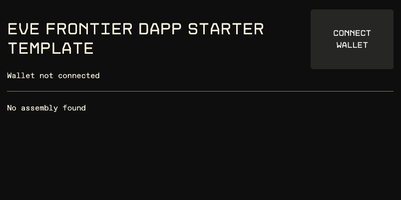
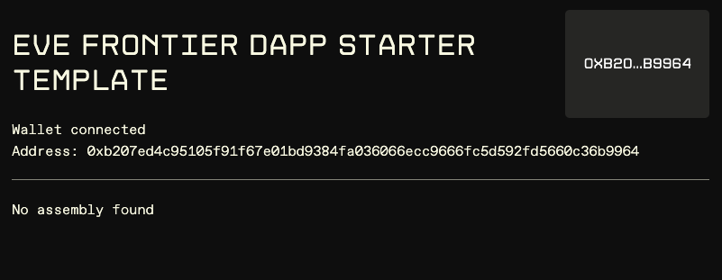

# Getting Started

EVE Frontier Builder Scaffold dApps are built with [Vite](https://vitejs.dev/), [Tailwind](https://tailwindcss.com/), [React Router](https://reactrouter.com/en/main), [Mysten Labs dApp Kit](https://sdk.mystenlabs.com/dapp-kit/) and [EVE Frontier Dapp Kit](https://sui-docs.evefrontier.com/). Before you begin:

### Step 1: Install pre-requisites 

```bash copy
# PNPM
curl -fsSL https://get.pnpm.io/install.sh | sh -

# Node v22
nvm use 22
```

Also ensure that you have [EVE Vault](../eve-vault/browser-extension.md) installed.

### Step 2: Setup local dApp
Run these commands to set up your local development DApp:
```bash copy
git clone https://github.com/evefrontier/builder-scaffold.git
cd builder-scaffold/dapps
pnpm install
```

### Step 3: Create a local `.env` by cloning the provided `.envsample`
Change the .env variables to be:
```bash copy
# OPTIONAL Sui Object ID
VITE_OBJECT_ID=

# World package id and graphql endpoint
## Stillness (TBA)
VITE_EVE_WORLD_PACKAGE_ID=""
## OR 
## Utopia
VITE_EVE_WORLD_PACKAGE_ID="0xd12a70c74c1e759445d6f209b01d43d860e97fcf2ef72ccbbd00afd828043f75"

VITE_SUI_GRAPHQL_ENDPOINT="https://graphql.testnet.sui.io/graphql"
```

### Step 4: Start dApp 
Start the dApp by using:
```bash copy
pnpm dev
```

### Step 5: Open http://localhost:5173/ to view your dApp.
You should now be able to view the dApp in your browser.



Click on "Connect wallet" to see your wallet connected to the dApp.




### Step 6: Production 
When you're ready to deploy to production, create a minified bundle.

```bash copy
pnpm build
```