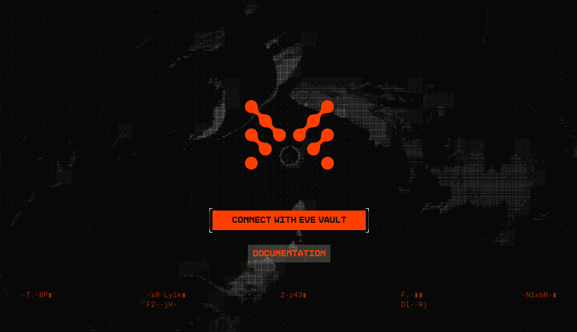
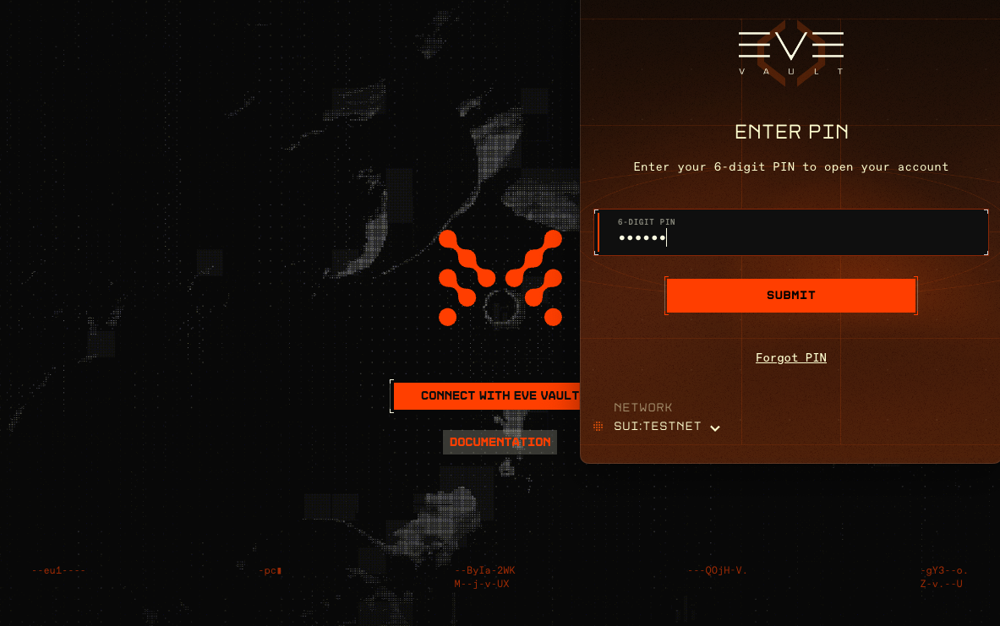

# Navigating in an external browser

The dApp uses the [Sui Wallet Standard](https://docs.sui.io/standards/wallet-standard) to enable discoverability with Sui wallets. The only wallet currently supported with the EVE Frontier dApps is [Eve Vault](/EveVault).

Open a browser and connect to [https://dapps.evefrontier.com/?tenant=stillness](https://test.dapps.evefrontier.com/?tenant=stillness) (Stillness) or [https://uat.dapps.evefrontier.com/?tenant=utopia](https://uat.dapps.evefrontier.com/?tenant=utopia) (Utopia).

Click on Connect with EVE Vault. This will prompt your EVE Vault extension to connect. If EVE Vault is currently locked, you will see a pop-up with a prompt to enter your PIN.

### Connected tenant and itemId

The selected assembly is determined by using query parameters from the URL. `?tenant` and `?itemId` must be defined.

ItemId is the in-game game item ID, e.g. `1000000012345`.

Your completed URL should look something like `https://dapps.evefrontier.com/?tenant=stillness&itemId=12345...`