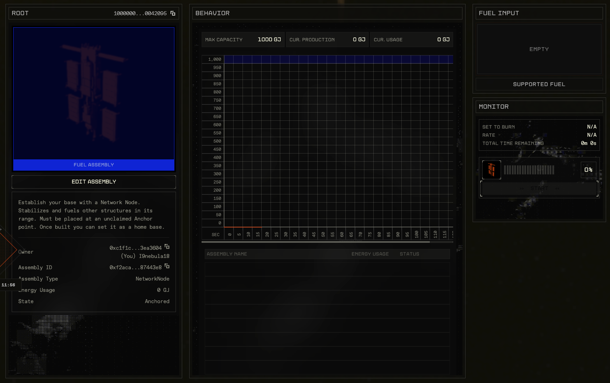
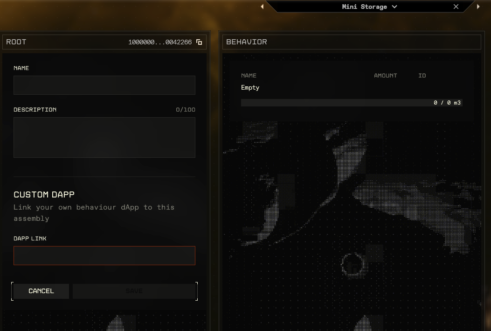
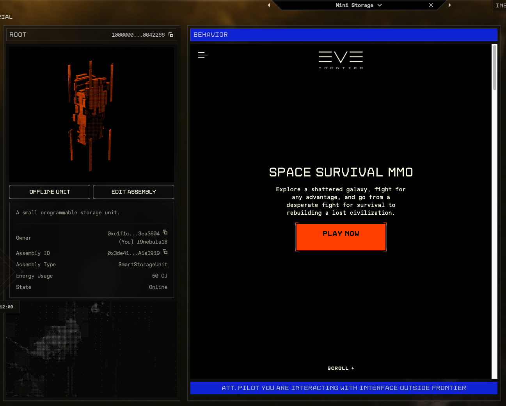
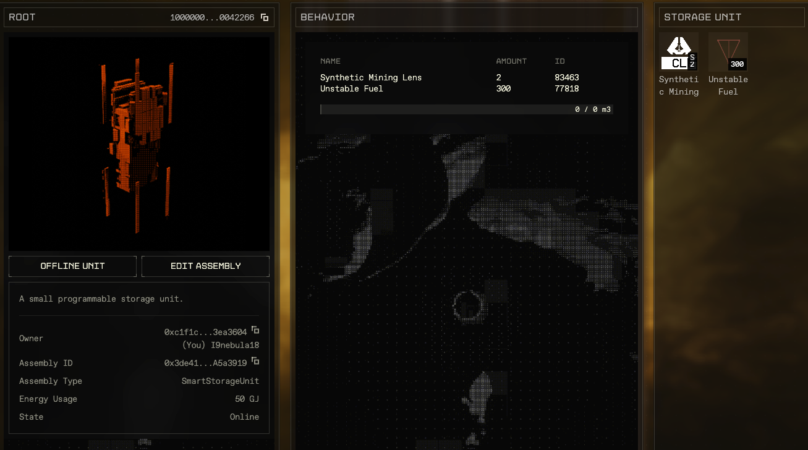

# Navigating the dApp In-Game

Every Assembly has a Base dApp. This base dApp lets you configure properties of smart assemblies that you own or interact with, and view aspects of others' Assemblies.

1. In the EVE Frontier game client, navigate to a built Assembly, such as a Network Node.
2. Press **F** to interact. The in-game browser opens, showing the configuration dApp page for Smart Assembly you selected.

The dApp displays primitive, view-only information for every Smart Assembly. This includes publicly viewable information about the owner and state.

### dApp Actions

The owner of an Assembly can use the Smart Assembly Base dApp to set a custom name, description, and URL. These changes are on-chain actions, but are submitted as [sponsored transactions](https://sui-docs.evefrontier.com/functions/useSponsoredTransaction.html) so they have no GAS cost to the player.

To change a unit's name, description or URL:

1. Click the "Edit unit" button.
2. Make changes accordingly under dApp URL, Unit name or Unit description.
3. Click **Save**. This submits the change to a sponsored transaction endpoint, retrieving the transaction bytes, signing them, and returning them for submission to the chain.

**Note**: You must be a unit's owner to set its URL, name or description.

### Custom dApps

Some units may have an associated external URL for website built and maintained by the unit's owner. These associated URLs allow builders to create UIs from which they can configure smart hooks easily. Only unit owners may add or edit URLs.

Users can view these custom dApps in-game, but should be aware that these dApps are entirely independent of the CCP safe zone.

Any functions called by external dApps are sent as [gas-consuming transactions](https://sdk.mystenlabs.com/dapp-kit/react/hooks/use-dapp-kit#transaction-execution). Users must have SUI in their wallet in order to successfully call any builder functions. A Sui faucet is [available here](https://faucet.sui.io/) if required.

### Modules

Assemblies are tagged as a Smart Storage Unit, Smart Turret or Smart Gate. These tags are detected in the Smart Assembly dApp, and their respective installed modules are then rendered.

#### Inventory Module

An inventory module grants storage capacity and lets players store inventory items in a **Storage Unit**.

To interact with on-chain inventory items, users must link them to the chain through depositing them in the _Ephemeral Inventory_ holding area.

Once inventory items are deposited to the _Ephemeral Inventory_, they are accessible for on-chain transactions and other interactions. Items in a player's inventory are viewable in the Inventory Module UI of the dApp.

