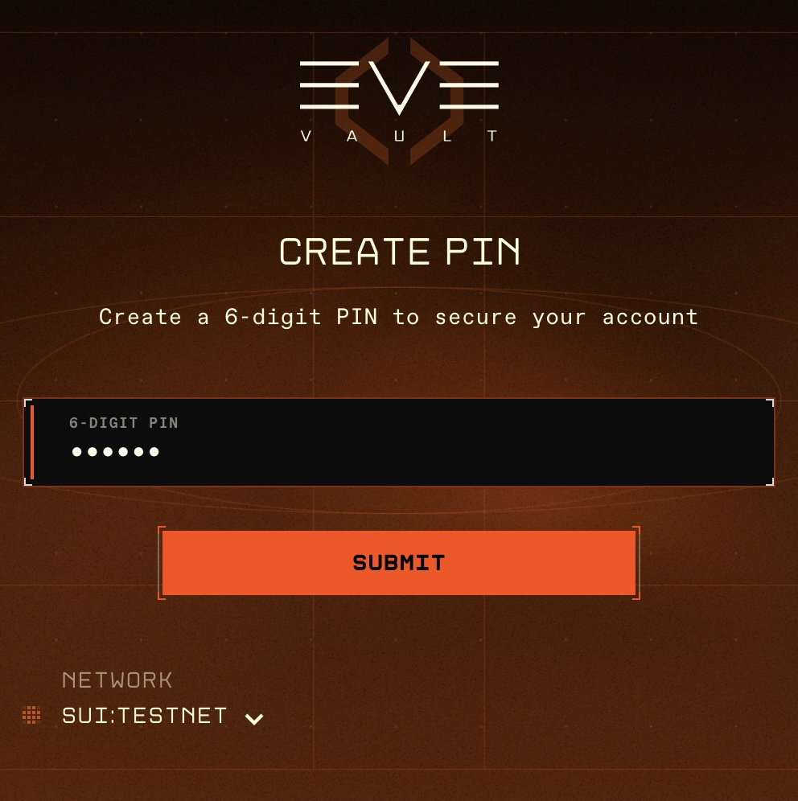
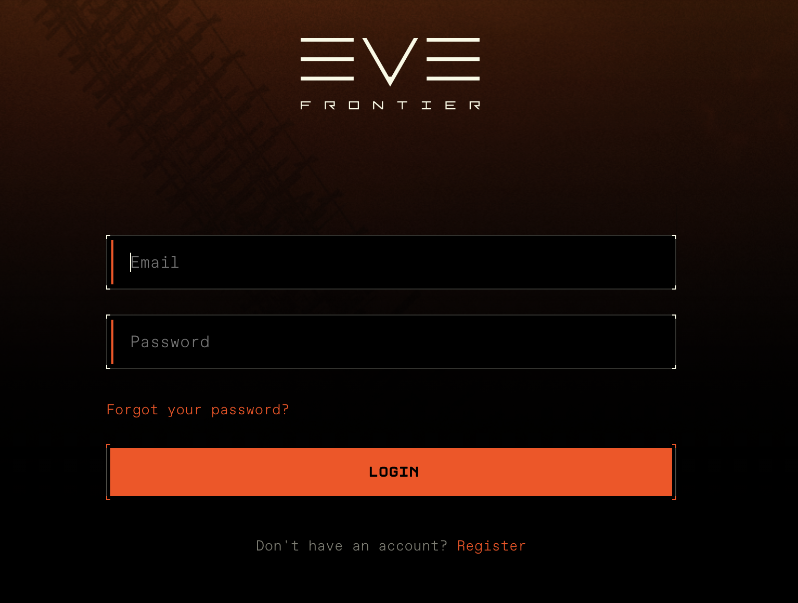
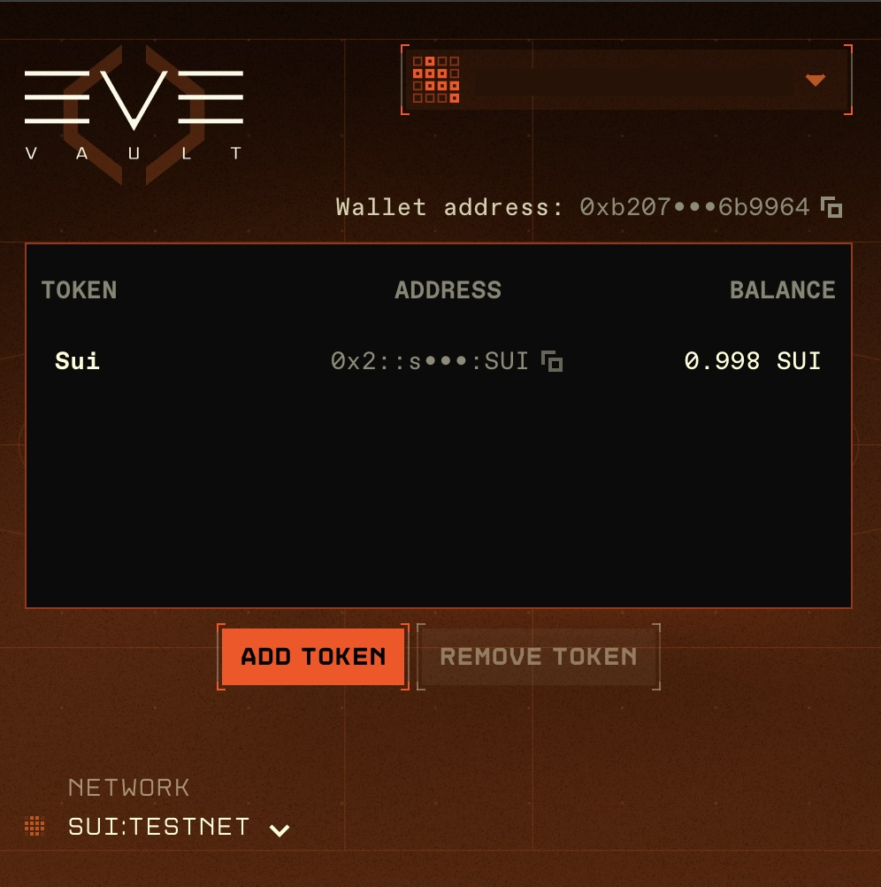

# Eve Vault Browser Extension

Install the Eve Vault browser extension to use the vault from Chrome.

## Download

Get the latest extension from the release:

**[Eve Vault v0.0.5](https://github.com/evefrontier/evevault/releases/download/v0.0.5/eve-vault-chrome-v0.0.5.zip)**

Download the zip asset from the release page.

## Installation (Chrome)

1. **Unzip** the downloaded file to a folder on your computer (e.g. `evevault-extension`).
2. Open Chrome and go to **chrome://extensions/**.
3. Turn on **Developer mode** (toggle in the top-right).
4. Click **Load unpacked**.
5. Select the folder where you unzipped the extension.
6. The Eve Vault extension will appear in your extensions list and in the Chrome toolbar.

## Sign in

After installing, open the extension and sign in with your credentials for the Utopia server. Follow these steps:

### 1. Create a 6-digit PIN

When you open the extension for the first time, you’ll be asked to create a **6-digit PIN**. This PIN is used to unlock the vault on this device.

### 2. Open the sign-in flow

On the sign-in screen, click **Log in**. This opens the Eve Frontier sign-in flow.

### 3. Sign in with your Utopia credentials

Use your **Utopia server credentials** (Eve Frontier account) to sign in. Enter your email and password when prompted.

### 4. Use the dashboard

After signing in successfully, you’ll see the **Eve Vault dashboard**, where you can manage your wallet and transactions.

---

For source code and more releases, see the [evevault repository](https://github.com/evefrontier/evevault).
