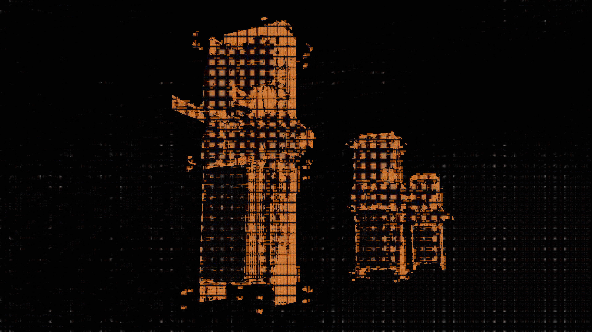

# Storage Unit

<figure><figcaption></figcaption></figure>

## Introduction

The Smart Storage Unit (SSU) is a **programmable, on-chain storage structure**. Players can store, withdraw, and manage items and the owner can define custom rules through extension contracts.

## Design
A storage unit has two types of inventories:

- **Primary inventory** — owned by the storage unit owner, accessed via the storage unit's `OwnerCap`. This is the main inventory for the owner's items.
- **Ephemeral inventories** — temporary, per-character inventories for players other than the owner. Used for trading, deposits, etc. Ephemeral inventories have a smaller capacity than the primary inventory to prevent abuse of the owner's storage unit.

Ephemeral inventories are created on-demand and stored as dynamic fields keyed by the character's `OwnerCap` ID. Each ephemeral inventory is accessed by the interacting character's own `OwnerCap`, like biometric authentication for temporary access. This avoids minting separate `OwnerCap`s just for ephemeral inventory access.

Items in inventories are on-chain representations of in-game resources.

## Interacting with a Storage Unit

### 1. Bridging Items (Game to Chain)

For any on-chain interaction, items must first be available on-chain. Players move items from in-game into the chain, and can move them back out to the game.

- **Game → Chain** — items are minted on-chain from in-game data.
- **Chain → Game** — on-chain items are burned and returned to the game.

### 2. Owner Deposit & Withdraw

Once items are on-chain, the owner can deposit and withdraw directly using their owner capability. The owner signs the transaction and proves access with their `OwnerCap`; They can perform these actions from a dApp.

### 3. Custom Logic via Extensions

The owner can deploy custom rules (a [Move contract](https://github.com/evefrontier/world-contracts)) and register it as the storage unit’s extension. After that, the extension controls how items are deposited or withdrawn — for example:

- **Vending machine** — players pay (e.g. in tokens) and receive an item from the unit.
- **Trade hub** — custom rules for listing, buying, and exchanging items.
- **Gated access** — only characters that meet certain conditions can deposit or withdraw.
- **Extension-to-owned** — the extension can deposit items into a specific player’s owned inventory (e.g. async delivery, guild hangars, rewards); the recipient does not need to be the transaction sender.

The extension uses the same pattern as the [Gate](../gate/README.md): the owner authorizes a contract type on the storage unit, and that contract’s logic runs when players interact. For API details and build steps, see the [Storage Unit Build Guide](./build.md).

## Next Steps

Build a custom storage unit extension: [Build Guide](./build.md)

**Reference:**
- [world-contracts](https://github.com/evefrontier/world-contracts) — EVE Frontier Sui Move contracts
- [storage_unit.move](https://github.com/evefrontier/world-contracts/blob/main/contracts/world/sources/assemblies/storage_unit.move) — core storage unit module
- [inventory.move](https://github.com/evefrontier/world-contracts/blob/main/contracts/world/sources/primitives/inventory.move) — inventory primitives
- [contracts/world](https://github.com/evefrontier/world-contracts/tree/main/contracts/world) — world contract package
- [world-contracts releases](https://github.com/evefrontier/world-contracts/releases)