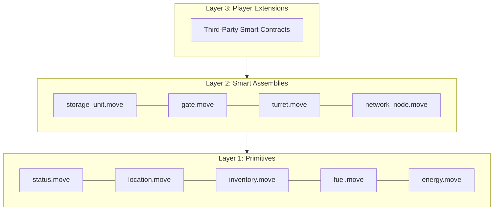
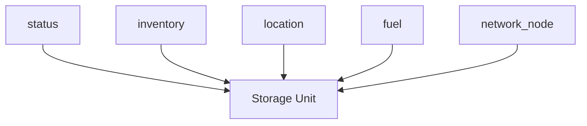

# EVE Frontier World Explainer

<figure><figcaption></figcaption></figure>

The EVE Frontier world runs on [Sui](https://sui.io/) as Move smart contracts that define in-game structures, physics, and rules. The design stresses **composition over inheritance**: small building blocks combine into assemblies, which players can extend with custom logic.

---

## The Three-Layer Architecture

The world contracts use a three-layer architecture:



**Layer 1: Primitives** — Low-level Move modules that implement the "digital physics" of the game. They are small, focused, and designed for reusability without circular dependencies. Examples: `location.move`, `inventory.move`, `fuel.move`, `status.move`, `network_node.move`.

**Layer 2: Assemblies** — Composed structures that players interact with (Storage Unit, Gate, Turret). Each assembly is a Sui shared object, enabling concurrent access by the game server and players. Assemblies combine primitives and expose public functions protected by capabilities or witnesses.

**Layer 3: Player Extensions** — Custom smart contracts built by players that extend assembly behavior. Extensions register with assemblies via the typed authentication witness pattern and are authorized by type identity.

Assemblies compose primitives. Player extensions authenticate via the [typed witness pattern](https://move-book.com/programmability/witness-pattern) when calling Layer 2.

---

## Layer 1: Primitives

Primitives are small, focused Move modules that implement basic mechanics:

- **`location.move`** — Spatial positioning and hashed location storage (for privacy).
- **`inventory.move`** — Item storage and transfers.
- **`fuel.move`** — Energy and resource consumption mechanics.
- **`status.move`** — Lifecycle of assembly (Anchored, Online, Offline).
- **`energy.move`** — Power generation and reservation.

Primitives expose `public(package)` functions, so only modules in the same package can mutate them. Players do not call primitives directly; assemblies use them internally. Primitive access is restricted to Frontier-designed assemblies.

**How assemblies use primitives** (example: Storage Unit):



Other assemblies compose subsets of these primitives (e.g., Gate = status + location + fuel + network_node).

---

## Layer 2: Smart Assemblies

Assemblies are in-game structures (storage units, gates and turrets) that players deploy and interact with. Each assembly is a **Sui shared object**, allowing concurrent access by the game and multiple players.

**Storage Unit** — Programmable on-chain storage. Supports extensions (via typed witness) and direct owner access.

**Gate (Stargate)** — Handles traversal between gates. Supports extensions (via typed witness).

**Turret** — Programmable structure for defense and targeting. Supports extensions (via typed witness).

Assemblies orchestrate primitives, enforce "digital physics" (e.g., proximity checks before withdraw), and expose public functions. 

---

## Layer 3: Player Extensions (Moddability)

Players extend assembly behavior by deploying custom Move packages that register with assemblies through a **typed authentication witness** pattern. The assembly keeps an allowlist of registered extension `TypeName`s. A builder registers their witness type; only that module can create instances of it, so only that extension can call the assembly's authenticated entry points.

**Flow:**
1. Owner registers a witness type (e.g., `Builder::Auth`) from the builder's package.
2. Assembly adds the `TypeName` to its allowlist.
3. Builder's module calls assembly functions by passing its witness; the assembly verifies the type is registered.

```move
// World: assembly maintains allowlist of registered extension types
module world::assembly {
    public struct Assembly has key {
        id: UID,
        allowed_extensions: Option<TypeName>,
        // ... other fields
    }

    public fun perform_op<Auth: drop>(assembly: &mut Assembly, _auth: Auth) {
        // Verify Auth type is registered in allowed_extensions
        // ... business logic
    }

    public fun register_extension<Auth: drop>(assembly: &mut Assembly, owner_cap: &OwnerCap) {
        // Add extension_type to allowed_extensions
    }
}

// Builder: custom extension defines a witness type
module builder::custom_extension {
    public struct Auth has drop {} // Witness type — only this module can create it

    public entry fun swap_items(assembly: &mut world::assembly::Assembly) {
        world::assembly::perform_op(assembly, Auth {})
    }
}

// Owner registers the extension type (requires owner_cap)
assembly::register_extension<builder::custom_extension::Auth>(assembly, owner_cap);

// Players can then call the custom extension's entry points
builder::custom_extension::swap_items(assembly);
```

**Benefits:** Type-based authorization; dynamic registration without redeploying assemblies; builders add custom logic while assemblies enforce authorization by type identity.

---

## Privacy: Location Obfuscation

To support mechanics that require information asymmetry (e.g., hidden bases):

- **Hashed locations** — On-chain locations are stored as cryptographic hashes, not cleartext coordinates.
- **Proximity verification** — Interactions require proof that entities are at the same or adjacent locations. Current implementation uses signatures from a trusted game server; future implementations may use zero-knowledge proofs.

---

## Security Model

- **AdminACL operations** — Require the transaction to be sponsored by a authorised server.
- **Owner operations** — Require ownership certificates (e.g., `OwnerCap`) for assembly-specific changes.
- **Extension operations** — Use the witness type's `TypeName` to ensure calls come from registered third-party modules.

---

## Next Steps

**Learn more (Smart Contracts)** :
- [Object Model](object-model.md) - how objects are derived and shared.
- [Ownership Model](ownership-model.md) — understand access control.
- [Move Patterns in Frontier](move-patterns-in-frontier.md) — Key patterns used in the world contracts.

**Start Building** :
- Assembly-specific build guides: [Storage Unit](../smart-assemblies/storage-unit/README.md), [Gate](../smart-assemblies/gate/README.md), [Turret](../smart-assemblies/turret/README.md) 
- [Interfacing with the EVE Frontier World](../tools/interfacing-with-the-eve-frontier-world.md) — How to read and write on-chain state.

**Reference** 
- [World Contracts](https://github.com/evefrontier/world-contracts) 
- [ADR](https://github.com/evefrontier/world-contracts/blob/main/docs/architechture.md)
