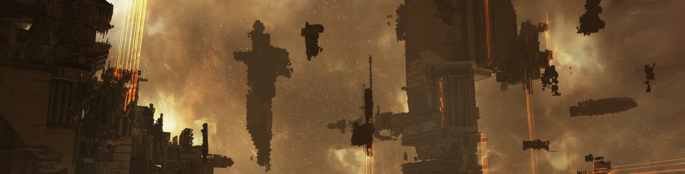

# Smart Infrastructure

<figure><figcaption></figcaption></figure>

**Smart Infrastructure** in EVE Frontier transforms the game world into a truly programmable sandbox. As a builder, you’re empowered to create, extend, and customize persistent in-game structures (Smart Assemblies) using modern on-chain technology—centered now on the Sui blockchain and its language, Move.

## What Are Smart Assemblies?

Smart Assemblies are special in-game infrastructure: programmable, player-built structures anchored to specific locations within the EVE Frontier universe. Each assembly can serve a unique mechanical purpose and exposes configurable interfaces for builders to innovate far beyond default gameplay features.

Key examples include:

* **Smart Storage Unit**: Storage and dispensing of items.
* **Smart Turret**: Automated defense of zones and assets.
* **Smart Gate**: Transportation or access control.
* ...and many more to be designed, upgraded, and customized as the game continues to evolve.

## Builder Agency and Expression

Smart Assemblies are at the heart of EVE Frontier’s open-world philosophy. Every base, turret, shop, or gate can be programmed with new logic, interfaces, and behaviors. As a builder, you can evolve a storage unit into a real-time marketplace, a quest dispensing kiosk, or a mini-game terminal. The underlying rules are transparent, verifiable, and persistent—once deployed, your innovations become part of the simulation and its history.

What can you enable?

* **New game mechanics** (trading, missions, rewards)
* **Advanced asset management** (locking, dispensing, tokenization)
* **Player-driven economies** and custom rulesets
* **Automation** and real-time reactions to world events
* **Composable systems that extend other builders' creations** — your marketplace can use someone else's currency, your gate can reference another player's access list
* **External dApps and tools** that interact with the game world from outside the client
* ...and much, much more.

## The Technology: Sui and Move

Smart Assemblies are built and managed on the Sui blockchain, leveraging its unique features for developer access, composability, and security. Programming is done in [Move](https://move-language.github.io/move/), a language designed for safe, flexible on-chain interactions.

> **Note:** You do not need to be a Move expert to get started. Many tools, templates, and builder guides simplify the process, letting you focus on gameplay, not boilerplate.

## Ready to Begin?

Check out the available Smart Assemblies for inspiration, or dive into tutorials on creating your own.

Explore:

* [Smart Storage Unit](../smart-assemblies/storage-unit/README.md) — store, automate, trade
* [Smart Turret](../smart-assemblies/turret/README.md) — defend, alert, customize
* [Smart Gate](../smart-assemblies/gate/README.md) — transport, restrict, innovate
