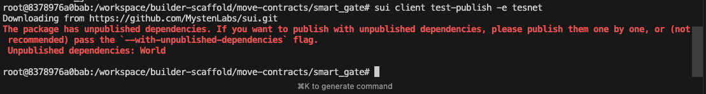

# Sui development environment (Docker)

One container with **Sui CLI**, **Node.js**, and **pnpm**. No host tooling needed.

For the full builder-scaffold flow (world deploy → publish contract → run scripts) inside this container, see [builder-flow-docker.md](../docs/builder-flow-docker.md).

## Prerequisites

- [Docker](https://docs.docker.com/get-docker/) installed

## Quick start

```bash
cd docker
docker compose run --rm --service-ports sui-dev
```

On first run the container creates three ed25519 keypairs (`ADMIN`, `PLAYER_A`, `PLAYER_B`). Keys persist across container restarts via a Docker volume.

Every start spins up a fresh local Sui node and funds the accounts from the faucet.

## What’s in the container

- **Sui CLI** — build and publish Move packages, interact with localnet/testnet
- **Node.js & pnpm** — run world-contracts and builder-scaffold TS scripts
- **Pre-funded keys** — `ADMIN`, `PLAYER_A`, `PLAYER_B` in `docker/.env.sui` (and in container at `/workspace/builder-scaffold/docker/.env.sui`)

## Workspace layout

```
/workspace/
├── builder-scaffold/    # full repo (syncs with host)
└── world-contracts/     # bind mount — clone here on host, visible inside container
```

Edit files on your host, run commands in the container. To build and publish Move contracts, see [move-contracts/readme.md](../move-contracts/readme.md)

## Using testnet

The container starts on **localnet**, but you can use testnet the same way you would on your host machine:

```bash
sui client switch --env testnet

# Fund your local keys on testnet by requesting gas
https://faucet.sui.io/

# Or import separate testnet keys if you prefer
sui keytool import <your-private-key> ed25519
```

## Bring your own keys

If you want to use existing keys instead of the auto-generated ones:

```bash
sui keytool import <your-private-key> ed25519 --alias my-key
sui client switch --env testnet
sui client switch --address <your-address>
```

For TS scripts and world-contracts, manually fill in the `.env` files with your own keys and addresses instead of using `generate-world-env.sh`.

## Useful commands

| Task | Command |
|------|---------|
| View keys | `cat /workspace/builder-scaffold/docker/.env.sui` |
| List addresses | `sui client addresses` |
| Switch network | `sui client switch --env testnet` |
| Import a key | `sui keytool import <key> ed25519` |
| Stop local node | `pkill -f "sui start"` |
| Generate world-contracts .env | `/workspace/scripts/generate-world-env.sh` |
| Build a contract | `cd /workspace/builder-scaffold/move-contracts/smart_gate_extension && sui move build -e testnet` |
| Run TS scripts | `cd /workspace/builder-scaffold && pnpm configure-rules` |

## Connect to local node from host

Port **9000** is published. On your host:

```bash
sui client new-env --alias localnet --rpc http://127.0.0.1:9000
sui client switch --env localnet
```

Wait until the container logs `RPC ready` before connecting. Import keys from `docker/.env.sui` if needed.

## PostgreSQL Indexer & GraphQL

The compose setup includes PostgreSQL indexer and GraphQL support via `docker-compose.override.yml`.

**GraphQL endpoint**: `http://localhost:9125/graphql`

The indexer database is **automatically reset** on each container start to match the `--force-regenesis` behavior, ensuring the blockchain and indexer state stay synchronized.

To query via GraphQL from your host:

```bash
curl -X POST http://localhost:9125/graphql \
  -H "Content-Type: application/json" \
  -d '{"query": "{ chainIdentifier }"}'
```

Or use a GraphQL client like [Altair](https://altairgraphql.dev/) or [Insomnia](https://insomnia.rest/).

## Clean up / fresh start

```bash
docker compose down
docker compose build
docker compose run --rm --service-ports sui-dev
```

If you are still having problems you can stop the containers and do a full prune:

> [!WARNING]
> This deletes all your containers, volumes, and images not currently in use.

```bash
docker compose down
docker system prune -a --volumes
```

## Troubleshooting

1. **Move.lock wrong env?**  
   `rm Move.lock && sui move build -e testnet`

2. **"Unpublished dependencies: World"?**  
   Deploy world-contracts first (see [builder-flow.md — Deploy world and create test resources](../docs/builder-flow.md)), then pass its publication file:

   ```bash
   sui client test-publish --build-env testnet --pubfile-path ../../deployments/localnet/Pub.localnet.toml
   ```

   

## Windows PowerShell

Replace `$(pwd)` with `${PWD}` and use backticks (`` ` ``) for line continuation instead of `\`.
