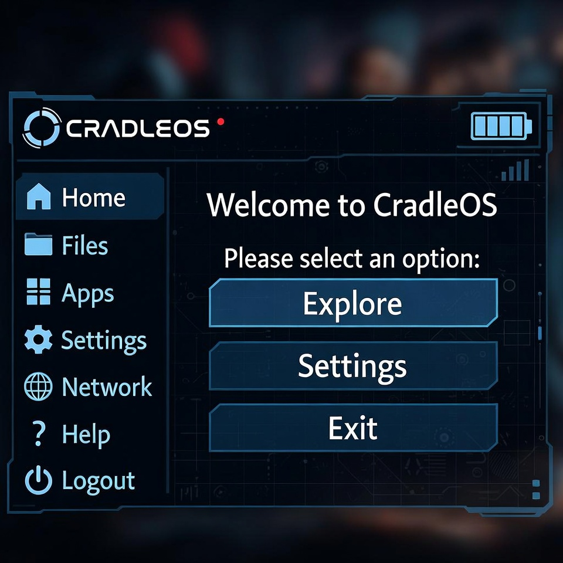

# CradleOS

<p align="center">
  
</p>

<p align="center">
  <strong>Wallet-native Corporation Command Stack for EVE Frontier</strong>
</p>

---

## What Is CradleOS?

CradleOS is a 3-module Sui Move extension that brings trustless, on-chain corporation
management to EVE Frontier. Built on top of EVE Frontier's Smart Assembly system, it enables
corps to gate jump gates to members, manage a shared treasury, and enforce commander control —
all from a Sui wallet, with zero off-chain coordination.

### Why It Matters

EVE Frontier gives players the ability to deploy programmable Smart Assemblies on-chain.
CradleOS extends that paradigm to the **corporation layer**: the social and logistical backbone
of EVE. By encoding membership, access control, and resource management directly in Move:

- **Member-gated jump gates** — only verified corp members can cross; no whitelists, no trust issues
- **Corp treasury** — a permissioned item bank where member deposits and withdrawals are tracked on-chain
- **Commander control** — a capability pattern that cleanly transfers command without contract redeploys
- **Composability** — `CorpRegistry` is a shared object; any future module can read membership without coupling to CradleOS internals

---

## Hackathon Track

| Field | Value |
|---|---|
| **Track** | In-world mod (Smart Assembly extension) |
| **Also eligible** | Live Frontier Integration |
| **Categories** | Utility · Technical Implementation · Live Frontier Integration |

---

## Tech Stack

- **Sui Move 2024.beta** — typed witness extension pattern, capability objects, shared objects
- **EVE Frontier world contracts** — `world::gate::Gate`, `world::storage_unit::StorageUnit`, `world::character::Character`
- **Dynamic fields** — per-assembly config stored on-chain without registry coupling
- **Typed witness pattern** — `CorpGateAuth` and `CorpTreasuryAuth` ensure only CradleOS can issue permits / move treasury items

---

## Module Overview

| Module | Purpose | Key Capability |
|---|---|---|
| `corp_registry` | Central shared membership store | `CommanderCap` gates all mutations; `is_member()` exposed for extensions |
| `corp_gate` | Member-gated jump gate extension | Issues time-limited `JumpPermit` NFTs to verified corp members |
| `corp_treasury` | Corp-gated SSU item bank | Tracks per-member credited balances; commander drain with generation counter |

---

## Architecture

```
                        ┌─────────────────────┐
                        │    CorpRegistry      │
                        │  (shared object)     │
                        │                      │
                        │  name: String        │
                        │  commander: address  │
                        │  members: vector<ID> │
                        │  member_table: Table │
                        └────────┬────────────-┘
                                 │  is_member() / corp_id()
               ┌─────────────────┴──────────────────┐
               │                                    │
    ┌──────────▼──────────┐             ┌───────────▼──────────┐
    │     corp_gate        │             │    corp_treasury      │
    │                      │             │                       │
    │  CorpGateAuth {}     │             │  CorpTreasuryAuth {}  │
    │  CorpGateConfig      │             │  TreasuryState        │
    │  (dynamic field      │             │  (dynamic field       │
    │   on Gate)           │             │   on StorageUnit)     │
    └──────────┬───────────┘             └───────────┬──────────┘
               │                                     │
               ▼                                     ▼
    ┌─────────────────────┐             ┌─────────────────────────┐
    │  world::gate::Gate  │             │ world::storage_unit::   │
    │  (Smart Assembly)   │             │ StorageUnit (SSU)       │
    └─────────────────────┘             └─────────────────────────┘
```

---

## Status

> **Pre-hackathon boilerplate.** This repository contains struct definitions, error constants,
> event types, and function signatures only. No implementation logic is present.
> **Implementation begins March 11, 2026** when the EVE Frontier × Sui Hackathon opens
> and the Utopia testnet world package address becomes available.

See [DESIGN.md](DESIGN.md) for full architecture details, design decisions, and open questions.

---

## Team

<!-- team members -->

---

*CradleOS — EVE Frontier × Sui 2026 Hackathon submission*
