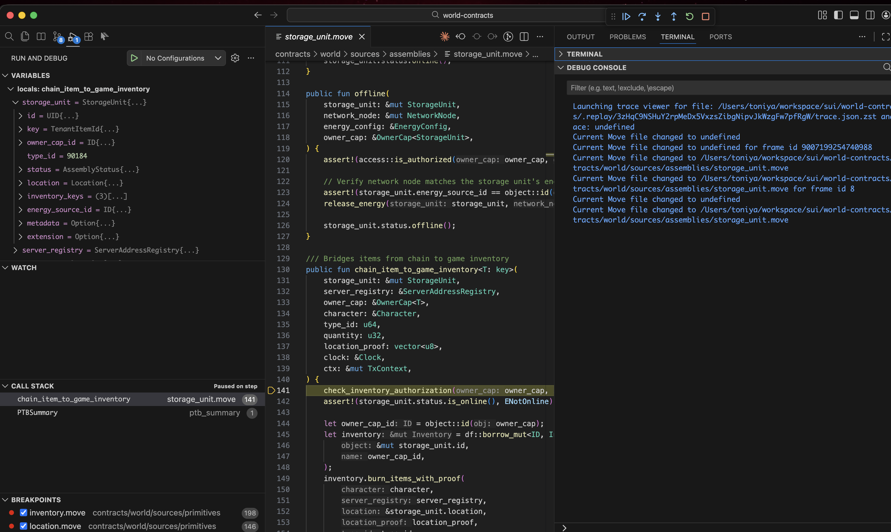

# Debugging On-Chain Failed Transactions

This guide explains how to debug on-chain failed transactions using the Move Trace Debugger extension in Visual Studio Code.

## Prerequisites

- [Move extension for VS Code](https://marketplace.visualstudio.com/items?itemName=mysten.move) installed (includes the Move Trace Debugger)
- `sui` binary installed with the `tracing` feature flag enabled
- Access to the transaction digest of the failed transaction

## Overview

When debugging on-chain transactions, the source code is not available by default as it is not stored on-chain. To enable source-level debugging, you need to:

1. Generate execution traces for the transaction
2. Build your Move package to generate debugging metadata
3. Copy the build artifacts to the replay directory
4. Start a debug session in VS Code

## Quick Start
For a faster setup, you can use the automated script that handles steps 1-3:

```bash
npm run debug:prepare <TRANSACTION_DIGEST>
```

For example:

```bash
npm run debug:prepare 3zHqC9NSHuY2rpMeDx5VxzsZibgNipvJkWzgFw7pfRgW
```

This script will:
1. Generate execution traces
2. Build your Move package
3. Automatically find the package ID
4. Copy build artifacts to the correct location

After running the script, proceed to [Step 4](#step-4-start-debugging-in-vs-code) to start debugging in VS Code.

**Note:** If the trace file already exists (e.g., from a previous run), the `sui replay` command may fail with an error like "Trace file already exists" or "Replay terminated due to error". This error can be safely ignored - the script will continue with the next steps as long as the replay directory and trace file exist.

## Step-by-Step Process

If you prefer to run the steps manually or need more control, follow the steps below:

### Step 1: Generate Execution Traces

Use the `sui replay` command with the `--trace` flag to generate execution traces for the failed transaction:

```bash
sui replay --trace --digest <TRANSACTION_DIGEST>
```

Replace `<TRANSACTION_DIGEST>` with your actual transaction digest. For example:

```bash
sui replay --trace --digest 3zHqC9NSHuY2rpMeDx5VxzsZibgNipvJkWzgFw7pfRgW
```

### Step 2: Build Your Move Package

Build your Move package to generate debugging metadata:

```bash
sui move build
```

This creates a `build` directory in your package (e.g., `contracts/world/build/World/`) containing all the debugging metadata needed for source-level debugging.

### Step 3: Copy Build Artifacts to Replay Directory

Copy the build directory to the corresponding package directory in the replay folder. The package ID can be found in the `.replay/<TRANSACTION_DIGEST>/` directory structure.

```bash
cp -r contracts/world/build/World .replay/<TRANSACTION_DIGEST>/<PACKAGE_ID>/source
```

For example:

```bash
cp -r contracts/world/build/World .replay/3zHqC9NSHuY2rpMeDx5VxzsZibgNipvJkWzgFw7pfRgW/0x25ff0911b6fafe65e489acf1d02fbf4ca7eb64a6809f74c918b3fff1aa46b8ed/source
```

**Note:** The package ID (`0x25ff0911b6fafe65e489acf1d02fbf4ca7eb64a6809f74c918b3fff1aa46b8ed` in the example) is the on-chain package ID. You can find it by listing the directories in `.replay/<TRANSACTION_DIGEST>/`.

### Step 4: Start Debugging in VS Code

1. **Open the trace file:**
   - Navigate to `.replay/<TRANSACTION_DIGEST>/trace.json.zst` in VS Code's file explorer
   - Click on the file to open it

2. **Start the debug session:**
   - Go to **Run** → **Start Debugging** (or press `F5`)
   - Select **Move Debug** from the debug configuration options

   
   *The Run menu showing "Start Debugging" option*

3. **Debug your transaction:**
   - The debugger will start in source view (if source code is available) or disassembly view
   - You can now:
     - **Set breakpoints** by clicking in the gutter next to line numbers
     - **Step through code** using:
       - `F10` - Step Over
       - `F11` - Step Into
       - `Shift+F11` - Step Out
       - `F5` - Continue
     - **Inspect variables** in the Variables panel
     - **View the call stack** in the Call Stack panel
     - **See exactly where the transaction fails** by stepping through execution

   
   *Active debug session showing source code, variables, call stack, and breakpoints*

## Troubleshooting

### Source Code Not Available

If you're still seeing disassembly view after copying build artifacts:
- **Make sure the source code is the same as the deployed source code** - If the source code has changed since deployment, the debugging metadata won't match and source-level debugging won't work properly. Check out the correct git commit/tag that corresponds to the deployed package version.
- Verify the package ID matches the on-chain package ID
- Ensure the build directory was copied to the correct location: `.replay/<DIGEST>/<PACKAGE_ID>/source`
- Check that the build was successful and contains debugging metadata

### Automated Script Issues

If the automated script (`prepare-debug.sh`) fails:

- **Package ID not found**: The script tries to automatically detect the package ID, but if your transaction involves multiple packages, you may need to manually copy build artifacts to each package directory.

- **Wrong package ID selected**: If the script selects the wrong package ID, you can manually copy the build artifacts:
  ```bash
  cp -r contracts/world/build/World .replay/<DIGEST>/<CORRECT_PACKAGE_ID>/source
  ```

## Additional Resources

- [Move Trace Debugger Documentation](https://github.com/MystenLabs/sui/blob/5b1116d82181a2efe66859548a10d6abea1418b3/docs/content/references/ide/debugger.mdx#source-level-debugging-for-on-chain-transactions)
- [Sui Replay Tool Documentation](https://docs.sui.io/references/cli/client#sui-client-replay)
- [VS Code Debugging Guide](https://code.visualstudio.com/docs/debugtest/debugging)